# 🌐 Awesome Community Platform [](https://github.com/ishandutta2007/Awesome-Awesome-Awesome)

<p align="center">
  
</p>

<p align="center">
  <a href="https://github.com/ishandutta2007/Awesome-Awesome-Awesome"></a>
  <a href="https://discord.gg/jc4xtF58Ve"></a>
  <a href="https://github.com/ishandutta2007/Awesome-Community-Platform/stargazers"></a>
  <a href="https://github.com/ishandutta2007/Awesome-Community-Platform/network/members"></a>
  <a href="https://github.com/ishandutta2007/Awesome-Community-Platform/issues"></a>
  <a href="http://makeapullrequest.com"></a>
  <a href="https://opensource.org/licenses/MIT"></a>
  <a href="https://github.com/ishandutta2007"></a>
</p>

---

## 📖 Overview & SEO Guide

**Awesome Community Platform** is a curated index of the best **SaaS hosted software** and **open-source GitHub repositories** for building, hosting, managing, and scaling modern digital communities.

Whether you are launching a **customer support forum**, **developer community hub**, **creator membership platform**, **decentralized Fediverse network**, **internal employee social intranet**, or **alumni organization portal**, this resource covers the entire ecosystem—including discussion engines, real-time messaging, knowledge bases, member authentication, push notification pipelines, community analytics, and AI-powered moderation.

---

## 📑 Table of Contents

- [☁️ SaaS & Hosted Community Platforms](#-saas--hosted-community-platforms)
- [💻 Open-Source GitHub Projects](#-open-source-github-projects)
  - [💬 Full Community & Forum Platforms](#-full-community--forum-platforms)
  - [👥 Social Networks & Member Platforms](#-social-networks--member-platforms)
  - [🌌 Decentralized & Federated Networks (Fediverse)](#-decentralized--federated-networks-fediverse)
  - [⚡ Real-Time Chat & Collaboration](#-real-time-chat--collaboration)
  - [📚 Knowledge Sharing, Wikis & Q&A](#-knowledge-sharing-wikis--qa)
  - [📅 Events, Ticketing & Community Assembly](#-events-ticketing--community-assembly)
  - [📊 Community Analytics & Intelligence](#-community-analytics--intelligence)
  - [🔍 Search & Discovery Engines](#-search--discovery-engines)
  - [🔔 Notifications & Messaging Infrastructure](#-notifications--messaging-infrastructure)
  - [🔐 Identity, Authentication & Backend](#-identity-authentication--backend)
  - [🛡️ Moderation & Community Safety](#-moderation--community-safety)
- [🏗️ Recommended Open-Source Stacks](#-recommended-open-source-stacks)
- [🏛️ Community Architecture & Data Model](#-community-architecture--data-model)
- [📈 Star History](#-star-history)
- [🤝 How to Contribute](#-how-to-contribute)
- [📜 Disclaimer & License](#-disclaimer--license)

---

## ☁️ SaaS & Hosted Community Platforms

*Ranked in descending order by company valuation / estimated revenue scale.*

| Platform | Company Size (Valuation / Revenue) | Description | Starting Pricing | Free Tier / Free Trial Limits |
| :--- | :--- | :--- | :--- | :--- |
| **[Gainsight Customer Communities](https://www.gainsight.com/)** *(inSided)* | 💰 **`$1.1B+` Valuation** (Acquired by Vista Equity) · **`~$200M+ ARR`** | Enterprise B2B customer community hub integrating product ideation, peer support, knowledge base, and customer success workflows. | ~$1,250/month (~$15,000/year billed annually) for Professional Plan | No permanent free plan; customized demo sandbox environment provided during sales evaluation (includes 3 admin seats, ideation portal, and CRM integrations) |
| **[Khoros Communities](https://khoros.com/platform/communities)** | 💰 **`~$500M+` Valuation** (Acquired by IgniteTech / ESW) · **`~$100M–$350M ARR`** | Enterprise-grade digital care and customer community software supporting high-volume discussion boards, peer-to-peer support, and deep analytics. | ~$6,250/month (~$75,000/year billed annually) for mid-market/enterprise deployments | No permanent free plan; guided proof-of-concept (POC) sandbox available on sales request tailored to specific MAU and moderation volume |
| **[Circle](https://circle.so/)** | 💰 **`~$250M` Valuation** · **`~$68M ARR`** ($30M+ funding) | Modern all-in-one community platform for creators, brands, and startups combining discussions, spaces, courses, live streams, paywalls, and event calendars. | $89/month (billed annually) or $99/month (billed monthly) for Professional Plan | 14-day free trial (no credit card required; full access to explore discussions, spaces, paywalls, and member management) |
| **[Higher Logic Thrive](https://www.higherlogic.com/)** | 💰 **`~$200M+` Est. Valuation** · **`~$68M+ ARR`** ($55M funding) | Dedicated member engagement and community platform purpose-built for associations, nonprofits, and professional membership organizations. | ~$750/month ($9,000/year billed annually) for entry-level association packages | No permanent free plan; sandbox test environment available during sales evaluation / demo for community and automated email workflows |
| **[Higher Logic Vanilla](https://www.higherlogic.com/products/vanilla/)** *(Vanilla Forums)* | 💰 **`~$200M+` Est. Valuation** (Higher Logic Group) · **`~$68M+ ARR`** | Cloud-based customer community and enterprise support forum platform offering discussions, Q&A, knowledge base, gamification, and moderation. | ~$2,000/month ($24,000/year billed annually) for Essential Plan (entry packages start ~$750/month or $9,000/year) | No permanent free plan; interactive demo sandbox evaluation provided upon sales request (includes 1 staging site, knowledge base, and moderation tools) |
| **[Discourse (Hosted)](https://www.discourse.org/)** | 💰 **`~$100M+` Est. Valuation** · **`~$35M+ ARR`** ($21M funding) | Fully managed cloud hosting for Discourse discussion forums, topics, categories, trust levels, moderation, search, notifications, and real-time chat. | $0/month (Free Plan); paid Pro plan starts at $100/month | Free forever plan (includes unlimited members, unlimited chat channels, 2 staff/admin seats, pre-configured social logins, hosted on `yourname.discourse.group`) |
| **[Hivebrite](https://hivebrite.com/)** | 💰 **`~$90M+` Est. Valuation** · **`~$22M–$26M ARR`** ($58.9M funding) | Scalable community engagement portal specialized for alumni networks, professional associations, universities, and corporate groups. | $895/month (billed annually at ~$10,740/year) for Core Plan | No permanent free plan; demo sandbox environment provided on discovery call (covers unlimited members, event ticketing, directory, and job boards) |
| **[Common Room](https://www.commonroom.io/)** | 💰 **`~$60M+` Est. Valuation** · **`~$15M–$17M ARR`** ($52.9M funding) | Community intelligence and customer engagement platform aggregating signals across forums, social channels, code repositories, and product usage. | $2,100/month (billed annually at $25,200/year) for Essential Plan | No permanent free plan; guided trial/pilot on demo request (Essential tier includes 5 seats, up to 100,000 tracked contacts, and monthly AI enrichment credits) |
| **[Mighty Networks](https://www.mightynetworks.com/)** | 💰 **`~$50M+` Est. Valuation** · **`~$8.6M–$12M ARR`** ($67.9M funding) | Creator and business community platform uniting member feeds, courses, events, memberships, live streaming, and native iOS/Android mobile apps. | $29/month (billed annually) or $35/month (billed monthly) for Explore Plan | 14-day free trial (no credit card required; access to Growth plan features including courses, events, and community building) |
| **[Bettermode](https://bettermode.com/)** *(formerly Tribe)* | 💰 **`~$25M+` Est. Valuation** · **`~$3.1M–$7M ARR`** ($7.5M funding) | Modular customer community and engagement platform with customizable spaces, posts, discussions, embeddable widgets, and developer APIs. | $399/month (billed annually) or $499/month (billed monthly) for Starter Plan | 14-day free trial (full access to Starter plan features including custom spaces, posts, moderation, and member onboarding) |
| **[Geneva](https://www.geneva.com/)** | 💰 **`$17M` Valuation** (Acquired by Bumble) · $26.5M funding | All-in-one group and community communication app combining chat rooms, forum posts, voice/video lounges, calendars, and broadcast channels. | $0/month (100% Free core platform) | Free forever with unlimited rooms, unlimited members, unlimited audio/video calls, event calendar, and zero ads |

---

## 💻 Open-Source GitHub Projects

*Sorted in descending order by GitHub Stars ⭐ within each specialized category.*

### 💬 Full Community & Forum Platforms

- **[Discourse](https://github.com/discourse/discourse)** [](https://github.com/discourse/discourse/stargazers) — The gold standard in open-source discussion forums. Built with Ruby on Rails and Ember.js; features trust levels, moderation, categorization, notifications, full-text search, plugins, and REST APIs.
- **[Forem](https://github.com/forem/forem)** [](https://github.com/forem/forem/stargazers) — Open-source community publishing platform empowering DEV.to and CodeNewbie. Provides feeds, posts, comments, reactions, tags, moderation, and podcasts.
- **[NodeBB](https://github.com/NodeBB/NodeBB)** [](https://github.com/NodeBB/NodeBB/stargazers) — Modern Node.js forum software with real-time streaming notifications, chat, custom themes, plugin architecture, and Redis/MongoDB database backends.
- **[Flarum](https://github.com/flarum/framework)** [](https://github.com/flarum/framework/stargazers) — Lightweight, ultra-fast PHP/Mithril.js discussion platform designed for simplicity, mobile elegance, and modular extensions.
- **[Misago](https://github.com/rafalp/Misago)** [](https://github.com/rafalp/Misago/stargazers) — Modern open-source Python & Django discussion board platform with user permissions, threads, categories, profiles, and API support.
- **[phpBB](https://github.com/phpbb/phpbb)** [](https://github.com/phpbb/phpbb/stargazers) — Battle-tested, mature PHP forum software with an extensive ecosystem of styles, extensions, permission systems, and user group management.
- **[Talkyard](https://github.com/debiki/talkyard)** [](https://github.com/debiki/talkyard/stargazers) — Multi-purpose open-source community platform combining classic forum discussions, StackOverflow-style Q&A, and blog comments.
- **[MyBB](https://github.com/mybb/mybb)** [](https://github.com/mybb/mybb/stargazers) — Free and open-source PHP bulletin board package with comprehensive administration, templating, and plugin support.

---

### 👥 Social Networks & Member Platforms

- **[Strapi](https://github.com/strapi/strapi)** [](https://github.com/strapi/strapi/stargazers) — Leading open-source Headless CMS for powering community content, member profiles, event listings, and mobile APIs.
- **[Ghost](https://github.com/TryGhost/Ghost)** [](https://github.com/TryGhost/Ghost/stargazers) — Open-source publishing and membership platform for independent creators, newsletters, community subscriptions, and paid access.
- **[Directus](https://github.com/directus/directus)** [](https://github.com/directus/directus/stargazers) — Instant REST and GraphQL data engine for any SQL database; perfect for powering custom community apps, member dashboards, and activity feeds.
- **[HumHub](https://github.com/humhub/humhub)** [](https://github.com/humhub/humhub/stargazers) — Flexible open-source social network kit written in PHP (Yii framework), built for organizations, social intranets, clubs, and co-working spaces.
- **[Drupal](https://github.com/drupal/drupal)** [](https://github.com/drupal/drupal/stargazers) — Enterprise content and community framework powering large-scale member portals, Open Social distributions, and organizational intranets.
- **[WordPress Develop](https://github.com/WordPress/wordpress-develop)** [](https://github.com/WordPress/wordpress-develop/stargazers) — Foundation for community-driven portals when combined with plugins like BuddyPress, bbPress, and MemberPress.
- **[Elgg](https://github.com/Elgg/Elgg)** [](https://github.com/Elgg/Elgg/stargazers) — Award-winning open-source social engine offering activity streams, user profiles, groups, access controls, and RESTful web services.
- **[BuddyPress](https://github.com/buddypress/buddypress)** [](https://github.com/buddypress/buddypress/stargazers) — Social networking component suite for WordPress adding user profiles, activity streams, user groups, and private messaging.

---

### 🌌 Decentralized & Federated Networks (Fediverse)

- **[Mastodon](https://github.com/mastodon/mastodon)** [](https://github.com/mastodon/mastodon/stargazers) — The premier open-source, decentralized microblogging network powered by ActivityPub.
- **[PeerTube](https://github.com/Chocobozzz/PeerTube)** [](https://github.com/Chocobozzz/PeerTube/stargazers) — Federated, ActivityPub-compatible video streaming platform for creator-led video communities.
- **[Lemmy](https://github.com/LemmyNet/lemmy)** [](https://github.com/LemmyNet/lemmy/stargazers) — Federated Reddit alternative built in Rust and Actix. Supports link aggregation, discussions, voting, and cross-instance federation.
- **[Misskey](https://github.com/misskey-dev/misskey)** [](https://github.com/misskey-dev/misskey/stargazers) — Interconnected, highly customizable decentralized social platform with rich reactions, drive storage, and emoji integration.
- **[Friendica](https://github.com/friendica/friendica)** [](https://github.com/friendica/friendica/stargazers) — Decentralized communications platform connecting users across ActivityPub, Diaspora, and Bluesky.

---

### ⚡ Real-Time Chat & Collaboration

- **[Rocket.Chat](https://github.com/RocketChat/Rocket.Chat)** [](https://github.com/RocketChat/Rocket.Chat/stargazers) — Enterprise open-source communications platform with channels, direct messaging, video meetings, omnichannel customer chat, and matrix federation.
- **[Mattermost](https://github.com/mattermost/mattermost)** [](https://github.com/mattermost/mattermost/stargazers) — Open-source collaboration platform for developer workflows, playbooks, boards, channels, and secure group communications.
- **[Jitsi Meet](https://github.com/jitsi/jitsi-meet)** [](https://github.com/jitsi/jitsi-meet/stargazers) — 100% open-source video conferencing solution for community webinars, live office hours, and virtual meetups.
- **[Zulip](https://github.com/zulip/zulip)** [](https://github.com/zulip/zulip/stargazers) — Thread-based team chat platform combining real-time messaging with the organized permanence of email threads.
- **[Element Web](https://github.com/element-hq/element-web)** [](https://github.com/element-hq/element-web/stargazers) — Flagship Matrix web client supporting end-to-end encrypted chats, rooms, communities, and voice/video spaces.
- **[Matrix Synapse](https://github.com/matrix-org/synapse)** [](https://github.com/matrix-org/synapse/stargazers) — Reference Matrix home server implementation enabling secure, decentralized communication networks.
- **[Revolt](https://github.com/revoltchat/backend)** [](https://github.com/revoltchat/backend/stargazers) — Open-source, user-first Discord alternative built for community servers, voice channels, and bot integrations.
- **[VoceChat](https://github.com/Privoce/VoceChat-Web)** [](https://github.com/Privoce/VoceChat-Web/stargazers) — Lightweight, embeddable community chat widget suitable for personal blogs, docs, and independent websites.

---

### 📚 Knowledge Sharing, Wikis & Q&A

- **[Outline](https://github.com/outline/outline)** [](https://github.com/outline/outline/stargazers) — Fast, modern, collaborative knowledge base and documentation platform built with React and Node.js.
- **[Wiki.js](https://github.com/requarks/wiki)** [](https://github.com/requarks/wiki/stargazers) — Feature-rich, modern Node.js wiki app with Markdown/WYSIWYG editors, search engines, and multi-cloud sync.
- **[Docmost](https://github.com/docmost/docmost)** [](https://github.com/docmost/docmost/stargazers) — Modern open-source collaborative wiki and documentation software for knowledge management.
- **[BookStack](https://github.com/BookStackApp/BookStack)** [](https://github.com/BookStackApp/BookStack/stargazers) — Simple, self-hosted documentation platform with an intuitive book/chapter/page organization system.
- **[Answer](https://github.com/answerdev/answer)** [](https://github.com/answerdev/answer/stargazers) — Modern Q&A community platform in Go for developer knowledge sharing, user troubleshooting, and peer support.
- **[MediaWiki](https://github.com/wikimedia/mediawiki)** [](https://github.com/wikimedia/mediawiki/stargazers) — The software behind Wikipedia; designed for massive, collaborative open-knowledge repositories.
- **[Documize](https://github.com/documize/community)** [](https://github.com/documize/community/stargazers) — Enterprise document and knowledge platform combining rich media, templates, and analytics.

---

### 📅 Events, Ticketing & Community Assembly

- **[Cal.com](https://github.com/calcom/cal.com)** [](https://github.com/calcom/cal.com/stargazers) — Open-source scheduling infrastructure for community 1-on-1 office hours, mentoring sessions, and group events.
- **[Pretix](https://github.com/pretix/pretix)** [](https://github.com/pretix/pretix/stargazers) — Comprehensive event ticketing, registration, and seating system for community conferences and gatherings.
- **[Decidim](https://github.com/decidim/decidim)** [](https://github.com/decidim/decidim/stargazers) — Participatory democracy and civic engagement framework for citizen assemblies, proposals, voting, and consultations.
- **[OpenSlides](https://github.com/OpenSlides/OpenSlides)** [](https://github.com/OpenSlides/OpenSlides/stargazers) — Assembly and plenary meeting management platform with agenda, motions, elections, and voting.

---

### 📊 Community Analytics & Intelligence

- **[PostHog](https://github.com/PostHog/posthog)** [](https://github.com/PostHog/posthog/stargazers) — All-in-one platform for product and community analytics, session recording, feature flags, surveys, and funnels.
- **[Umami](https://github.com/umami-software/umami)** [](https://github.com/umami-software/umami/stargazers) — Lightweight, privacy-focused, cookie-free analytics for community blogs, portals, and landing pages.
- **[Plausible Analytics](https://github.com/plausible/analytics)** [](https://github.com/plausible/analytics/stargazers) — Simple, open-source, GDPR-compliant web analytics providing intuitive dashboards for community pageviews.
- **[Matomo](https://github.com/matomo-org/matomo)** [](https://github.com/matomo-org/matomo/stargazers) — Full-featured Google Analytics alternative giving 100% data ownership for member behavior tracking.
- **[Countly](https://github.com/Countly/countly-server)** [](https://github.com/Countly/countly-server/stargazers) — Real-time mobile and web product analytics with push notification campaign integration.

---

### 🔍 Search & Discovery Engines

- **[Meilisearch](https://github.com/meilisearch/meilisearch)** [](https://github.com/meilisearch/meilisearch/stargazers) — Lightning-fast, typo-tolerant search engine built in Rust; perfect for indexing forum topics, user directories, and articles.
- **[Typesense](https://github.com/typesense/typesense)** [](https://github.com/typesense/typesense/stargazers) — Blazing-fast, typo-tolerant open-source search engine optimized for developer-friendly community search experiences.
- **[OpenSearch](https://github.com/opensearch-project/OpenSearch)** [](https://github.com/opensearch-project/OpenSearch/stargazers) — Distributed search and analytics suite offering scalable full-text indexing, vector search, and observability.
- **[Apache Solr](https://github.com/apache/solr)** [](https://github.com/apache/solr/stargazers) — Highly reliable, scalable enterprise search engine built on Apache Lucene.

---

### 🔔 Notifications & Messaging Infrastructure

- **[Novu](https://github.com/novuhq/novu)** [](https://github.com/novuhq/novu/stargazers) — Unified open-source notification infrastructure powering email, SMS, push, in-app feed, and chat notifications for community members.
- **[ntfy](https://github.com/binwiederhier/ntfy)** [](https://github.com/binwiederhier/ntfy/stargazers) — HTTP-based pub-sub push notification service for self-hosted community alerts and moderator pings.
- **[Apprise](https://github.com/caronc/apprise)** [](https://github.com/caronc/apprise/stargazers) — Push notification library supporting 80+ notification services including Discord, Telegram, Slack, and Matrix.
- **[Gotify](https://github.com/gotify/server)** [](https://github.com/gotify/server/stargazers) — Simple server for sending and receiving push notifications via WebSockets with an Android client.

---

### 🔐 Identity, Authentication & Backend

- **[Supabase](https://github.com/supabase/supabase)** [](https://github.com/supabase/supabase/stargazers) — The open-source Firebase alternative with Postgres, realtime subscriptions, authentication, storage, and auto-generated APIs.
- **[Appwrite](https://github.com/appwrite/appwrite)** [](https://github.com/appwrite/appwrite/stargazers) — Complete backend-as-a-service providing auth, database, cloud functions, and real-time messaging for web/mobile community apps.
- **[Keycloak](https://github.com/keycloak/keycloak)** [](https://github.com/keycloak/keycloak/stargazers) — Industry-standard Identity and Access Management (IAM) supporting OpenID Connect, OAuth 2.0, SAML 2.0, and SSO across community tools.
- **[Authentik](https://github.com/goauthentik/authentik)** [](https://github.com/goauthentik/authentik/stargazers) — Modern, flexible identity provider designed for easy integration with self-hosted Docker and Kubernetes community environments.
- **[ORY Kratos](https://github.com/ory/kratos)** [](https://github.com/ory/kratos/stargazers) — Cloud-native identity, user management, and authentication system for high-scale custom community portals.

---

### 🛡️ Moderation & Community Safety

- **[Detoxify](https://github.com/unitaryai/detoxify)** [](https://github.com/unitaryai/detoxify/stargazers) — Open-source deep-learning toxicity detection models for identifying abuse, insults, and harassment in community posts.

---

## 🏗️ Recommended Open-Source Stacks

For organizations looking to build self-hosted alternatives to Circle, Mighty Networks, Khoros, or Bettermode, here are proven open-source architecture recipes:

### 🌟 All-Around Community Hub
> **Discourse + Keycloak + Meilisearch + Matrix Synapse + Wiki.js + PostHog + Novu + PostgreSQL**
- **Use Case:** Broad community forums, discussions, member messaging, docs, analytics, and notification delivery.

### 🏢 Private Professional / Employee Social Network
> **HumHub + Authentik + OpenSearch + Element/Matrix + Matomo**
- **Use Case:** Internal company networks, closed alumni directories, collaborative workspaces, and event calendars.

### 💻 Developer & Tech Community
> **Forem + Answer + Discourse + Docmost + PostHog + Cal.com**
- **Use Case:** Tech publishing, articles, technical Q&A, long-form discussions, and developer office hours.

### 🌌 Decentralized / Public Fediverse Community
> **Lemmy + Mastodon + PeerTube + Matrix + Meilisearch + ActivityPub**
- **Use Case:** Censorship-resistant public discussions, creator video channels, microblogging, and cross-server federation.

---

## 🏛️ Community Architecture & Data Model

```text
Community Core Model
 ├── 🏢 Organization
 │
 ├── 👤 Member
 │    ├── 📋 Profile
 │    ├── 🎖️ Role & Permissions
 │    ├── 📈 Reputation & Trust Levels
 │    ├── 🏅 Badges & Gamification
 │    ├── 🎯 Interests & Tags
 │    └── 💳 Membership & Subscriptions
 │
 ├── 🗂️ Space / Category
 │    ├── 👥 Sub-Group
 │    ├── 🏷️ Category
 │    ├── 💬 Discussion Topic / Thread
 │    └── ⚡ Real-Time Chat Channel
 │
 ├── 📝 Content Engine
 │    ├── ✍️ Post / Article
 │    ├── 🗨️ Comment / Reply
 │    ├── ❓ Question & Verified Answer
 │    └── 🖼️ Media & File Attachments
 │
 ├── 🤝 Engagement Signals
 │    ├── ❤️ Like / Reaction
 │    ├── 🔄 Repost / Share
 │    ├── 🔖 Bookmark
 │    └── 🔔 Follow / Watch
 │
 ├── 📅 Events & Activities
 │    ├── 🎫 RSVP / Registration
 │    ├── 🎟️ Ticketing & Attendance
 │    └── 📹 Live Stream / Recording
 │
 ├── ✉️ Communications
 │    ├── 📥 Direct Message (E2EE)
 │    ├── 📢 Broadcast Channel
 │    └── 🔔 Multi-channel Notification (Email/Push/SMS)
 │
 └── 🛡️ Moderation & Trust
      ├── 🚩 User Flag / Report
      ├── 🤖 Automated AI Filter (Detoxify)
      ├── ⚖️ Review Queue
      ├── 🔨 Mod Action (Mute/Ban/Warn)
      └── 📜 Dispute & Appeal
```

---

## 📈 Star History

[](https://star-history.dera.page/#ishandutta2007/Awesome-Community-Platform&type=date&legend=top-left)

---

## 🤝 How to Contribute

Contributions are warmly welcomed! To suggest a new SaaS product, open-source tool, or fix existing information:

1. **Fork** this repository.
2. Create your feature branch: `git checkout -b feature/add-new-platform`.
3. Ensure entries follow the existing markdown table or list style with factual details and official links.
4. Commit your changes: `git commit -m "Add Awesome Community Tool"`.
5. Push to the branch: `git push origin feature/add-new-platform`.
6. Open a **Pull Request** and describe your contribution!

Explore our master collection: [Awesome Awesome Awesome](https://github.com/ishandutta2007/Awesome-Awesome-Awesome).

---

## 📜 Disclaimer & License

- **License:** Distributed under the [MIT License](LICENSE).
- **Disclaimer:** All product names, logos, and brands are property of their respective owners. Mention of SaaS and open-source tools is for informational and educational curation purposes only.
